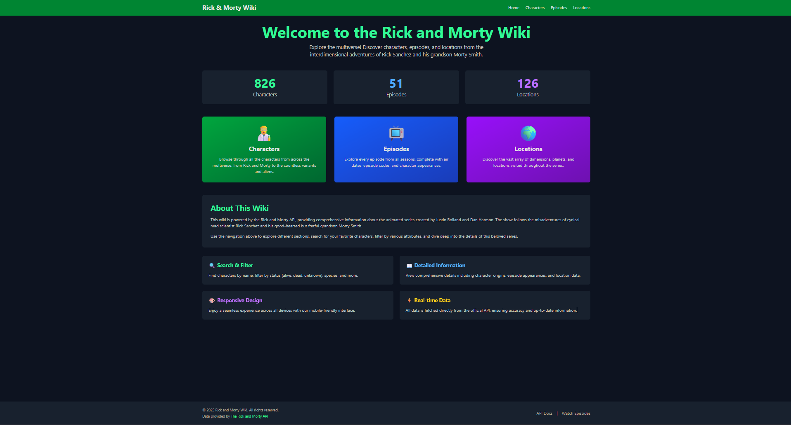
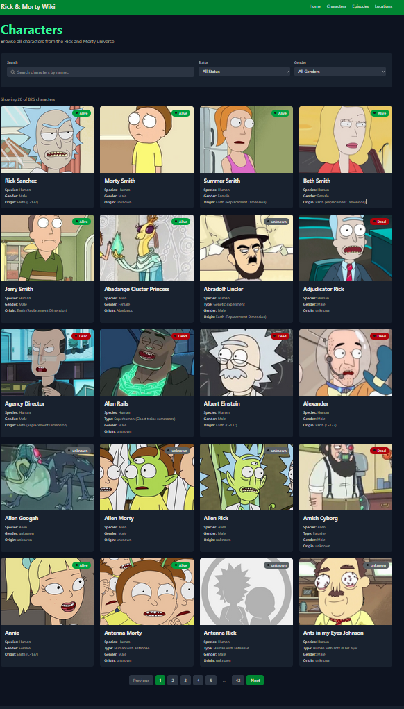
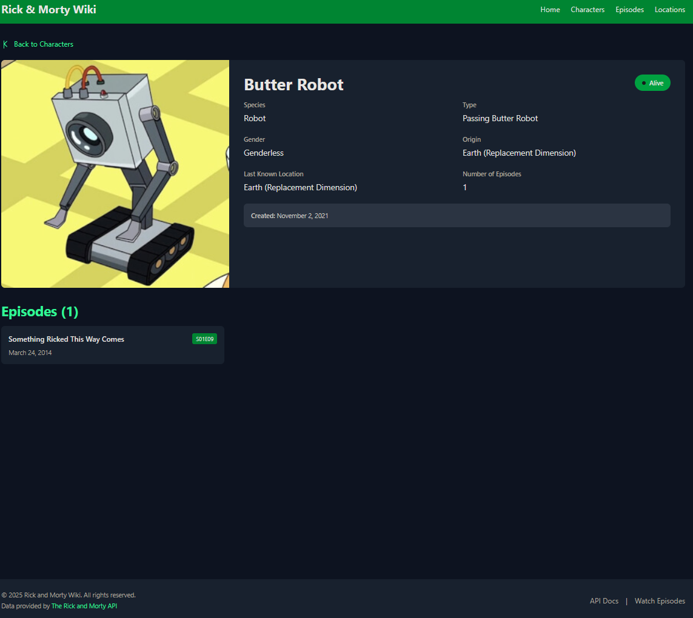
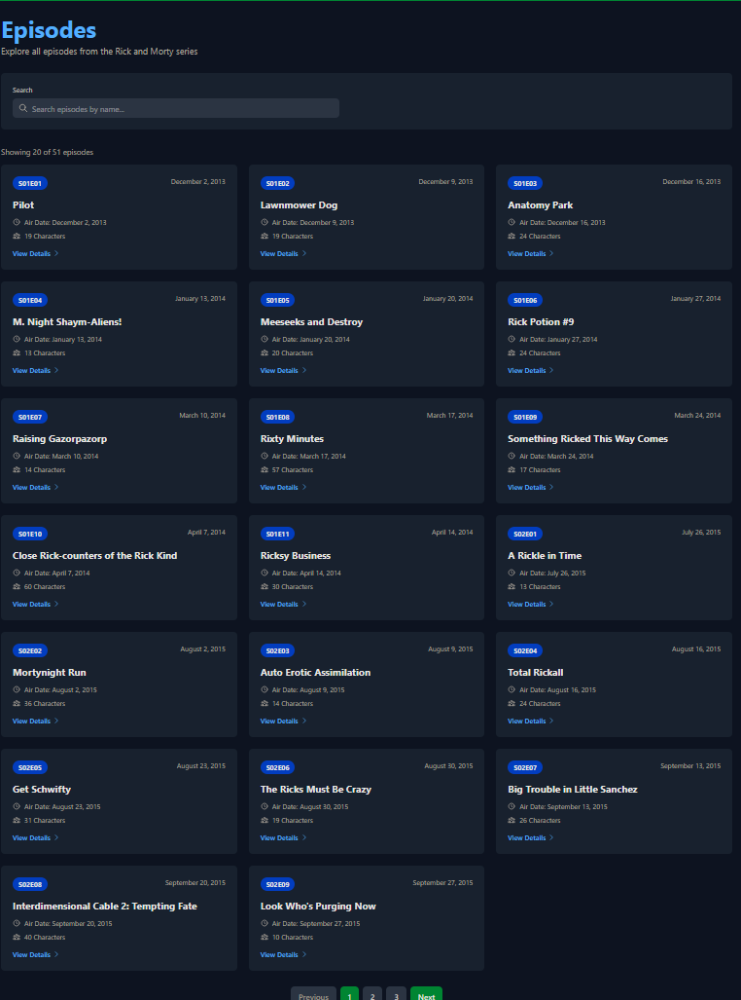
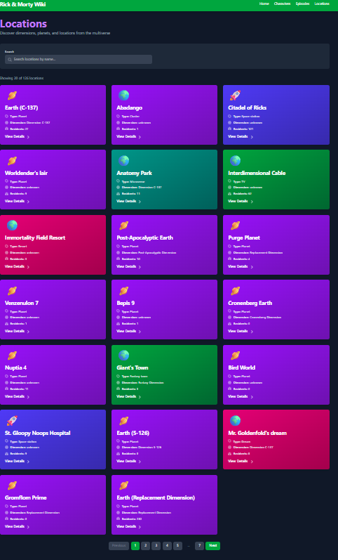

# 🚀 Rick and Morty Wiki

A comprehensive, responsive web application built with React that allows users to explore the Rick and Morty universe. Browse characters, episodes, and locations with advanced search and filtering capabilities.

## 📋 Table of Contents

- [Features](#features)
- [Demo](#demo)
- [Technologies](#technologies)
- [Usage](#usage)
- [API Reference](#api-reference)

## ✨ Features

### Core Features

- 🏠 **Home Page** - Welcome page with statistics and navigation
- 👥 **Characters** - Browse all characters with pagination
- 📺 **Episodes** - Explore all episodes from the series
- 🌍 **Locations** - Discover dimensions and planets

### Advanced Features

- 🔍 **Search Functionality** - Search characters, episodes, and locations by name
- 🎯 **Filtering** - Filter characters by status (Alive, Dead, Unknown) and gender
- 📄 **Pagination** - Navigate through multiple pages of results
- 📱 **Responsive Design** - Works seamlessly on desktop, tablet, and mobile
- ⚡ **Loading States** - Visual feedback during data fetching
- ❌ **Error Handling** - User-friendly error messages
- 🎨 **Modern UI** - Clean, dark-themed interface with smooth animations

### Technical Features

- ⚛️ **React Hooks** - Built with functional components using useState and useEffect
- 🛣️ **Dynamic Routing** - Client-side routing with React Router v6
- 🎨 **Tailwind CSS** - Utility-first CSS framework for styling
- 🔄 **Debounced Search** - Optimized search with 500ms debounce
- 🌐 **REST API Integration** - Fetches data from The Rick and Morty API
- 📦 **Component-Based Architecture** - Reusable and maintainable code structure

## 🎬 Demo

**Live Demo:** [Your Vercel URL here]

### Screenshots

#### Home Page

#### Characters Page

#### Character Detail

#### Episodes Page

#### Locations Page

## 🛠️ Technologies

- **React 18.2+** - JavaScript library for building user interfaces
- **Vite** - Next-generation frontend build tool
- **React Router v6** - Declarative routing for React
- **Tailwind CSS** - Utility-first CSS framework
- **Rick and Morty API** - Open-source REST API (no authentication required)

## 🎮 Usage

### Browsing Characters

1. Navigate to the "Characters" page
2. Use the search bar to find specific characters
3. Apply filters for status and gender
4. Click on any character card to view detailed information
5. Use pagination to browse through all characters

### Searching Episodes

1. Go to the "Episodes" page
2. Search for episodes by name
3. View episode details including air date and featured characters
4. Navigate between pages using pagination

### Exploring Locations

1. Visit the "Locations" page
2. Search for specific dimensions or planets
3. Click on a location to see all residents
4. Explore different types and dimensions

## 🔌 API Reference

This project uses **[The Rick and Morty API](https://rickandmortyapi.com/)**, which is a free, open-source REST API.
